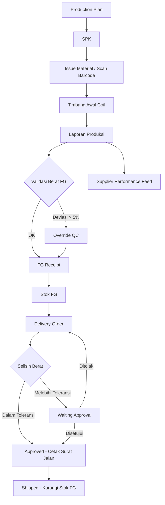
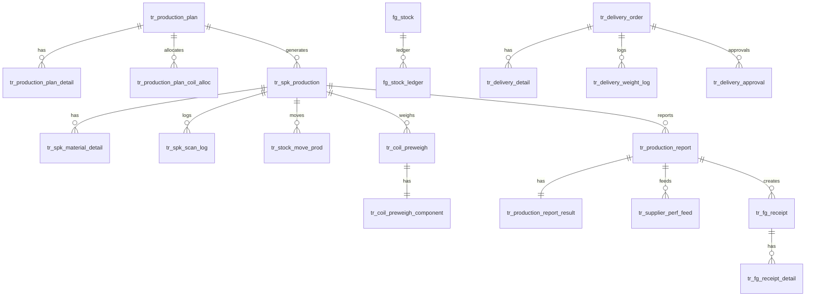
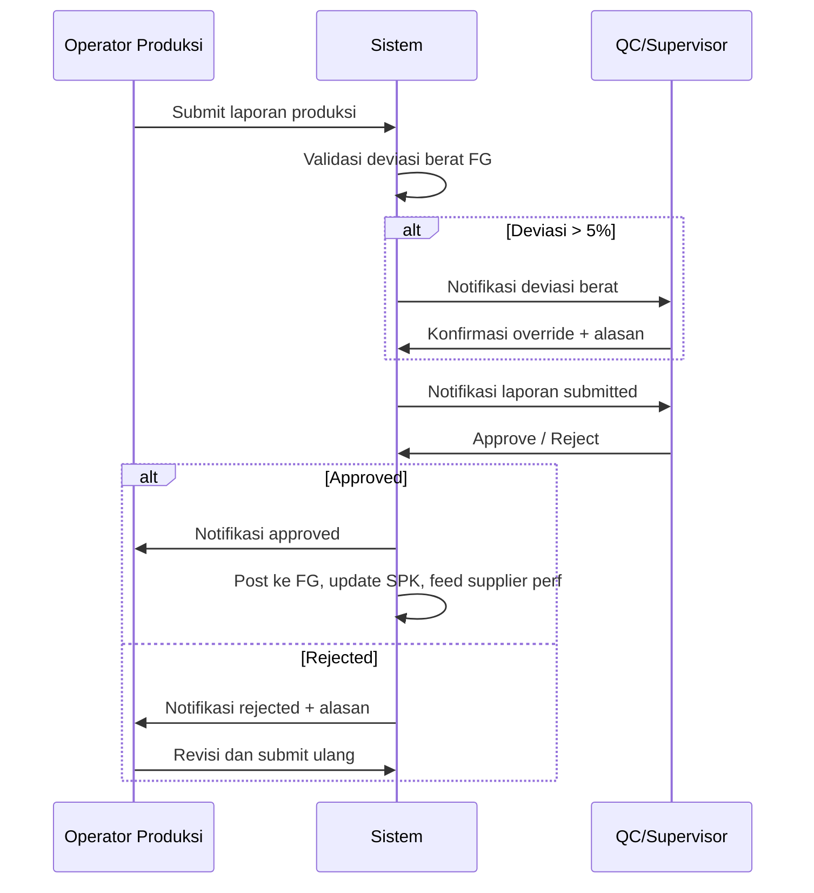
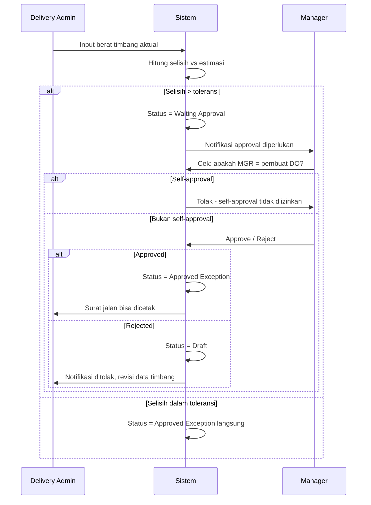

# Dokumen Desain Teknis: Produksi, FG, dan Delivery

## Overview

Modul **Produksi, FG, dan Delivery** merupakan ekstensi dari sistem inventory gudang coil/roll PT HFG yang sudah berjalan. Sistem ini mengimplementasikan alur end-to-end mulai dari perencanaan produksi hingga pengiriman barang jadi ke pelanggan.

### Tujuan Sistem

- Traceability coil dari penerimaan material hingga pengiriman FG
- Akurasi timbang dan pengendalian loss produksi
- Pengukuran kinerja supplier berbasis data produksi aktual
- Kontrol selisih berat saat delivery dengan mekanisme approval exception

### Alur Utama Sistem



---

## Arsitektur Sistem

### Stack Teknologi

- **Framework**: CodeIgniter 3 dengan HMVC (Modular Extensions)
- **Database**: MySQL
- **Frontend**: DataTables server-side, jQuery, Bootstrap
- **Base Controller**: `Admin_Controller` (semua controller modul mewarisi ini)

### Struktur Modul HMVC

```
application/modules/
├── production_planning/
│   ├── controllers/Production_planning.php
│   ├── models/Production_planning_model.php
│   └── views/
├── production_issue/
│   ├── controllers/Production_issue.php
│   ├── models/Production_issue_model.php
│   └── views/
├── production_weighing/
│   ├── controllers/Production_weighing.php
│   ├── models/Production_weighing_model.php
│   └── views/
├── production_report/
│   ├── controllers/Production_report.php
│   ├── models/Production_report_model.php
│   └── views/
├── fg_warehouse/
│   ├── controllers/Fg_warehouse.php
│   ├── models/Fg_warehouse_model.php
│   └── views/
├── delivery_fg/
│   ├── controllers/Delivery_fg.php
│   ├── models/Delivery_fg_model.php
│   └── views/
├── supplier_performance/
│   ├── controllers/Supplier_performance.php
│   ├── models/Supplier_performance_model.php
│   └── views/
└── production_dashboard/
    ├── controllers/Production_dashboard.php
    ├── models/Production_dashboard_model.php
    └── views/
```

### Konvensi MVC yang Diterapkan

Semua modul baru wajib mengikuti pemisahan tanggung jawab MVC secara ketat:

| Layer | Tanggung Jawab | Yang TIDAK boleh ada |
|-------|---------------|----------------------|
| **Model** | Query database, kalkulasi bisnis, return data array/object | HTML, echo, redirect, session |
| **Controller** | Terima request, panggil model, kirim data ke view, redirect | Query SQL langsung, logika tampilan |
| **View** | Render HTML, format tampilan, loop data | Query database, logika bisnis berat |

**Contoh pola yang benar:**

```php
// MODEL — hanya query dan kalkulasi
class Production_report_model extends CI_Model {
    public function get_report($report_no) {
        return $this->db->get_where('tr_production_report', ['report_no' => $report_no])->row();
    }
    public function calculate_total_berat($data) {
        return $data['reject_supplier'] + $data['waste_potong'] + $data['ng_internal']
             + $data['ng_supplier'] + $data['plat_bs'] + $data['fg_kg']
             + $data['kw2_internal_kg'] + $data['kw2_supplier_kg'];
    }
}

// CONTROLLER — penghubung model dan view
class Production_report extends Admin_Controller {
    public function view($report_no) {
        $data['report']  = $this->Production_report_model->get_report($report_no);
        $data['results'] = $this->Production_report_model->get_results($report_no);
        $this->template->render('view', $data);  // kirim ke view
    }
    public function save_report() {
        $post = $this->input->post();
        $total = $this->Production_report_model->calculate_total_berat($post);
        $this->Production_report_model->save($post, $total);
        redirect('production_report');
    }
}

// VIEW — hanya tampilan
// views/view.php
foreach ($results as $row) {
    echo '<tr><td>' . $row->fg_kg . '</td></tr>';
}
```

**Aturan tambahan:**
- Kalkulasi (rumus berat, yield, deviasi) → di **Model**
- Validasi input form → di **Controller** sebelum memanggil model
- Format angka, format tanggal, label status → di **View** atau helper
- DataTables server-side: query di Model, encode JSON di Controller

### Pola Method Controller

Setiap controller mengikuti pola standar berikut:

```php
class Nama_modul extends Admin_Controller {
    public function index()          // Load view list, data diambil via data_side_*()
    public function add()            // Load view form tambah
    public function edit($id)        // Load view form edit, ambil data dari model
    public function view($id)        // Load view detail, ambil data dari model
    public function data_side_*()    // Endpoint JSON untuk DataTables — query di model
    public function save_*()         // Terima POST, validasi, panggil model, redirect
    public function process_*($id)   // Terima POST aksi (approve/post/cancel), panggil model, return JSON
}
```

### Tabel Konfigurasi Parameter

Semua nilai toleransi dan parameter bisnis disimpan di tabel konfigurasi, tidak hardcoded:

```sql
CREATE TABLE ms_config_param (
    param_key   VARCHAR(100) PRIMARY KEY,
    param_value VARCHAR(255) NOT NULL,
    keterangan  VARCHAR(500),
    updated_by  INT,
    updated_at  DATETIME
);
```

Contoh data:
- `toleransi_timbang_pct` = `0.05` (5%)
- `toleransi_deviasi_fg_pct` = `0.05` (5%)

---

## Komponen dan Antarmuka

### Modul 1: `production_planning`

**Tanggung Jawab**: Membuat dan mengelola Production Plan serta alokasi coil.

**Controller Methods**:
- `index()` — list semua Production Plan dengan filter status
- `add()` / `edit($plan_no)` — form buat/edit plan, load coil available via AJAX
- `view($plan_no)` — detail plan beserta coil teralokasi
- `data_side_plan()` — DataTables endpoint untuk list plan
- `save_plan()` — POST: simpan plan baru/edit, status = `Draft`
- `process_release($plan_no)` — POST: ubah status ke `Released`, auto-generate SPK Draft
- `process_cancel($plan_no)` — POST: ubah status ke `Cancelled`
- `monitoring()` — halaman monitoring semua plan + progres coil

**AJAX Endpoint**:
- `get_coil_available()` — return JSON daftar coil status `available` di gudang material

### Modul 2: `production_issue`

**Tanggung Jawab**: Penerbitan SPK dan issue material via scan barcode.

**Controller Methods**:
- `index()` — list SPK
- `add($plan_no)` / `view($spk_no)` — form SPK
- `data_side_spk()` — DataTables endpoint
- `save_spk()` — POST: simpan SPK Draft
- `process_release_spk($spk_no)` — POST: ubah status SPK ke `Released`
- `scan_issue()` — halaman scan barcode issue material
- `process_scan()` — POST: validasi barcode, catat mutasi lokasi, update status coil
- `monitoring_coil()` — halaman monitoring coil in production
- `histori_coil($barcode)` — halaman riwayat mutasi coil

### Modul 3: `production_weighing`

**Tanggung Jawab**: Timbang awal coil sebelum produksi, perbandingan dengan packing list.

**Controller Methods**:
- `index()` — list record timbang awal
- `add()` — form timbang awal, scan barcode coil
- `view($preweigh_no)` — detail timbang awal
- `data_side_preweigh()` — DataTables endpoint
- `save_preweigh()` — POST: simpan data timbang, hitung net weight, cek toleransi
- `perbandingan($spk_no)` — halaman perbandingan timbang awal vs packing list per SPK

### Modul 4: `production_report`

**Tanggung Jawab**: Input hasil produksi, validasi berat FG, approval, posting ke FG.

**Controller Methods**:
- `index()` — list laporan produksi
- `add($spk_no)` / `edit($report_no)` — form input hasil produksi
- `view($report_no)` — detail laporan + yield breakdown
- `data_side_report()` — DataTables endpoint
- `save_report()` — POST: simpan laporan, hitung total berat, cek deviasi FG
- `process_submit($report_no)` — POST: ubah status ke `Submitted`, kirim notifikasi
- `process_approve($report_no)` — POST: ubah status ke `Approved` (QC/Supervisor)
- `process_reject($report_no)` — POST: ubah status ke `Rejected`
- `process_post($report_no)` — POST: posting ke FG, update status SPK, feed supplier perf
- `process_override_fg($report_no)` — POST: konfirmasi override deviasi berat FG

### Modul 5: `fg_warehouse`

**Tanggung Jawab**: Penerimaan FG, manajemen stok, berat referensi.

**Controller Methods**:
- `index()` — list FG Receipt
- `view($fg_receipt_no)` — detail receipt
- `data_side_receipt()` — DataTables endpoint
- `process_post_receipt($fg_receipt_no)` — POST: posting receipt, update stok, hitung berat referensi
- `process_cancel_receipt($fg_receipt_no)` — POST: cancel receipt, reverse stok
- `stok_fg()` — halaman stok FG terkini per produk
- `kartu_stok($produk_fg)` — halaman kartu stok dengan filter tanggal

### Modul 6: `delivery_fg`

**Tanggung Jawab**: Delivery Order, timbang aktual, approval exception, surat jalan.

**Controller Methods**:
- `index()` — list Delivery Order
- `add()` / `edit($do_no)` — form buat/edit DO
- `view($do_no)` — detail DO
- `data_side_do()` — DataTables endpoint
- `save_do()` — POST: simpan DO Draft, validasi stok
- `save_timbang($do_no)` — POST: simpan berat aktual, hitung selisih, cek toleransi
- `process_approve($do_no)` — POST: approve exception (Manager), cek self-approval
- `process_reject($do_no)` — POST: reject, kembalikan ke Draft
- `process_ship($do_no)` — POST: konfirmasi shipped, kurangi stok FG
- `process_cancel($do_no)` — POST: cancel DO, bebaskan reservasi stok
- `cetak_surat_jalan($do_no)` — GET: cetak surat jalan (hanya jika status Approved/Shipped)

### Modul 7: `supplier_performance`

**Tanggung Jawab**: Feed data kinerja supplier dan summary periodik.

**Controller Methods**:
- `index()` — halaman summary periodik dengan filter supplier & periode
- `feed_coil()` — halaman feed per coil per supplier
- `data_side_feed()` — DataTables endpoint feed
- `data_side_summary()` — DataTables endpoint summary
- `dashboard()` — dashboard perbandingan kinerja antar supplier

### Modul 8: `production_dashboard`

**Tanggung Jawab**: Dashboard analitis dan laporan manajerial.

**Controller Methods**:
- `index()` — dashboard utama (ringkasan produksi, stok FG, delivery)
- `laporan_timbang_awal()` — laporan perbandingan timbang awal vs packing list
- `laporan_hasil_produksi()` — laporan hasil produksi per SPK dengan yield
- `laporan_delivery_discrepancy()` — laporan selisih berat delivery
- `laporan_berat_fg()` — laporan berat standar vs aktual FG

---

## Data Models

### Skema Database Lengkap

#### Tabel Konfigurasi

```sql
CREATE TABLE ms_config_param (
    param_key   VARCHAR(100) PRIMARY KEY,
    param_value VARCHAR(255) NOT NULL,
    keterangan  VARCHAR(500),
    updated_by  INT,
    updated_at  DATETIME
);
```

#### Production Planning

```sql
CREATE TABLE tr_production_plan (
    plan_no      VARCHAR(30) PRIMARY KEY,
    tgl_plan     DATE NOT NULL,
    produk_fg    VARCHAR(50) NOT NULL,
    target_qty   DECIMAL(10,2) NOT NULL,
    status       ENUM('Draft','Released','Closed','Cancelled') DEFAULT 'Draft',
    created_by   INT NOT NULL,
    created_at   DATETIME DEFAULT CURRENT_TIMESTAMP,
    updated_at   DATETIME ON UPDATE CURRENT_TIMESTAMP
);

CREATE TABLE tr_production_plan_detail (
    id               INT AUTO_INCREMENT PRIMARY KEY,
    plan_no          VARCHAR(30) NOT NULL,
    id_material      INT NOT NULL,
    id_coil          INT NOT NULL,
    net_weight_coil  DECIMAL(10,3),
    estimasi_fg      DECIMAL(10,3),
    FOREIGN KEY (plan_no) REFERENCES tr_production_plan(plan_no)
);

CREATE TABLE tr_production_plan_coil_alloc (
    id           INT AUTO_INCREMENT PRIMARY KEY,
    plan_no      VARCHAR(30) NOT NULL,
    barcode_coil VARCHAR(100) NOT NULL,
    status_alloc ENUM('allocated','issued','done','cancelled') DEFAULT 'allocated',
    FOREIGN KEY (plan_no) REFERENCES tr_production_plan(plan_no)
);
```

#### SPK dan Issue Material

```sql
CREATE TABLE tr_spk_production (
    spk_no     VARCHAR(30) PRIMARY KEY,
    plan_no    VARCHAR(30) NOT NULL,
    produk_fg  VARCHAR(50) NOT NULL,
    target_qty DECIMAL(10,2) NOT NULL,
    tgl_spk    DATE NOT NULL,
    status     ENUM('Draft','Released','In Process','Submitted','Closed') DEFAULT 'Draft',
    created_by INT NOT NULL,
    created_at DATETIME DEFAULT CURRENT_TIMESTAMP,
    FOREIGN KEY (plan_no) REFERENCES tr_production_plan(plan_no)
);

CREATE TABLE tr_spk_material_detail (
    id           INT AUTO_INCREMENT PRIMARY KEY,
    spk_no       VARCHAR(30) NOT NULL,
    barcode_coil VARCHAR(100) NOT NULL,
    id_material  INT NOT NULL,
    FOREIGN KEY (spk_no) REFERENCES tr_spk_production(spk_no)
);

CREATE TABLE tr_spk_scan_log (
    id           INT AUTO_INCREMENT PRIMARY KEY,
    spk_no       VARCHAR(30) NOT NULL,
    barcode_coil VARCHAR(100) NOT NULL,
    scan_time    DATETIME NOT NULL,
    scan_user    INT NOT NULL,
    status_scan  ENUM('success','rejected') NOT NULL,
    keterangan   VARCHAR(255),
    FOREIGN KEY (spk_no) REFERENCES tr_spk_production(spk_no)
);

CREATE TABLE tr_stock_move_prod (
    id           INT AUTO_INCREMENT PRIMARY KEY,
    spk_no       VARCHAR(30) NOT NULL,
    barcode_coil VARCHAR(100) NOT NULL,
    from_gudang  VARCHAR(50) NOT NULL,
    to_gudang    VARCHAR(50) NOT NULL,
    move_time    DATETIME NOT NULL,
    move_user    INT NOT NULL,
    FOREIGN KEY (spk_no) REFERENCES tr_spk_production(spk_no)
);
```

#### Timbang Awal

```sql
CREATE TABLE tr_coil_preweigh (
    preweigh_no  VARCHAR(30) PRIMARY KEY,
    spk_no       VARCHAR(30) NOT NULL,
    barcode_coil VARCHAR(100) NOT NULL,
    gross_actual DECIMAL(10,3),
    gross_pl     DECIMAL(10,3),
    net_pl       DECIMAL(10,3),
    status       ENUM('Draft','Confirmed','Exception') DEFAULT 'Draft',
    created_by   INT NOT NULL,
    created_at   DATETIME DEFAULT CURRENT_TIMESTAMP,
    FOREIGN KEY (spk_no) REFERENCES tr_spk_production(spk_no)
);

CREATE TABLE tr_coil_preweigh_component (
    id                    INT AUTO_INCREMENT PRIMARY KEY,
    preweigh_no           VARCHAR(30) NOT NULL,
    berat_kulit           DECIMAL(10,3) DEFAULT 0,
    berat_clamp_ring      DECIMAL(10,3) DEFAULT 0,
    berat_coil_tong       DECIMAL(10,3) DEFAULT 0,
    berat_cover_wrapping  DECIMAL(10,3) DEFAULT 0,
    net_timbang_awal      DECIMAL(10,3) GENERATED ALWAYS AS
                          (berat_coil_tong + berat_cover_wrapping) STORED,
    FOREIGN KEY (preweigh_no) REFERENCES tr_coil_preweigh(preweigh_no)
);
```

#### Laporan Produksi

```sql
CREATE TABLE tr_production_report (
    report_no    VARCHAR(30) PRIMARY KEY,
    spk_no       VARCHAR(30) NOT NULL,
    barcode_coil VARCHAR(100) NOT NULL,
    status       ENUM('Draft','Submitted','Approved','Rejected','Posted to FG') DEFAULT 'Draft',
    override_fg  TINYINT(1) DEFAULT 0,
    override_alasan VARCHAR(500),
    created_by   INT NOT NULL,
    approved_by  INT,
    created_at   DATETIME DEFAULT CURRENT_TIMESTAMP,
    approved_at  DATETIME,
    FOREIGN KEY (spk_no) REFERENCES tr_spk_production(spk_no)
);

CREATE TABLE tr_production_report_result (
    id                  INT AUTO_INCREMENT PRIMARY KEY,
    report_no           VARCHAR(30) NOT NULL,
    reject_supplier     DECIMAL(10,3) DEFAULT 0,
    waste_potong        DECIMAL(10,3) DEFAULT 0,
    ng_internal         DECIMAL(10,3) DEFAULT 0,
    ng_supplier         DECIMAL(10,3) DEFAULT 0,
    plat_bs             DECIMAL(10,3) DEFAULT 0,
    fg_kg               DECIMAL(10,3) DEFAULT 0,
    fg_qty              DECIMAL(10,2) DEFAULT 0,
    kw2_internal_kg     DECIMAL(10,3) DEFAULT 0,
    kw2_internal_qty    DECIMAL(10,2) DEFAULT 0,
    kw2_supplier_kg     DECIMAL(10,3) DEFAULT 0,
    kw2_supplier_qty    DECIMAL(10,2) DEFAULT 0,
    tong_coil           DECIMAL(10,3) DEFAULT 0,
    FOREIGN KEY (report_no) REFERENCES tr_production_report(report_no)
);

CREATE TABLE tr_supplier_perf_feed (
    id                INT AUTO_INCREMENT PRIMARY KEY,
    report_no         VARCHAR(30) NOT NULL,
    barcode_coil      VARCHAR(100) NOT NULL,
    id_supplier       INT NOT NULL,
    selisih_gross     DECIMAL(10,3),
    selisih_net       DECIMAL(10,3),
    reject_supplier_kg DECIMAL(10,3) DEFAULT 0,
    ng_supplier_kg    DECIMAL(10,3) DEFAULT 0,
    kw2_supplier_kg   DECIMAL(10,3) DEFAULT 0,
    tgl_feed          DATE NOT NULL,
    FOREIGN KEY (report_no) REFERENCES tr_production_report(report_no)
);
```

#### FG Warehouse

```sql
CREATE TABLE tr_fg_receipt (
    fg_receipt_no VARCHAR(30) PRIMARY KEY,
    report_no     VARCHAR(30) NOT NULL,
    produk_fg     VARCHAR(50) NOT NULL,
    qty           DECIMAL(10,2) NOT NULL,
    total_berat   DECIMAL(10,3) NOT NULL,
    berat_satuan  DECIMAL(10,3),
    status        ENUM('Draft','Posted','Cancelled') DEFAULT 'Draft',
    created_by    INT NOT NULL,
    created_at    DATETIME DEFAULT CURRENT_TIMESTAMP,
    posted_at     DATETIME,
    FOREIGN KEY (report_no) REFERENCES tr_production_report(report_no)
);

CREATE TABLE tr_fg_receipt_detail (
    id            INT AUTO_INCREMENT PRIMARY KEY,
    fg_receipt_no VARCHAR(30) NOT NULL,
    produk_fg     VARCHAR(50) NOT NULL,
    qty           DECIMAL(10,2) NOT NULL,
    berat_total   DECIMAL(10,3) NOT NULL,
    berat_satuan  DECIMAL(10,3),
    metode_input  ENUM('FG','KW2_Internal','KW2_Supplier') NOT NULL,
    FOREIGN KEY (fg_receipt_no) REFERENCES tr_fg_receipt(fg_receipt_no)
);

CREATE TABLE ms_fg_weight_history (
    id               INT AUTO_INCREMENT PRIMARY KEY,
    produk_fg        VARCHAR(50) NOT NULL,
    berat_referensi  DECIMAL(10,3) NOT NULL,
    total_qty_stok   DECIMAL(10,2) NOT NULL,
    total_berat_stok DECIMAL(10,3) NOT NULL,
    effective_date   DATETIME NOT NULL,
    created_by       INT NOT NULL
);

CREATE TABLE fg_stock (
    id               INT AUTO_INCREMENT PRIMARY KEY,
    produk_fg        VARCHAR(50) UNIQUE NOT NULL,
    qty_stok         DECIMAL(10,2) DEFAULT 0,
    total_berat      DECIMAL(10,3) DEFAULT 0,
    berat_referensi  DECIMAL(10,3),
    last_update      DATETIME
);

CREATE TABLE fg_stock_ledger (
    id            INT AUTO_INCREMENT PRIMARY KEY,
    produk_fg     VARCHAR(50) NOT NULL,
    tgl_transaksi DATE NOT NULL,
    no_referensi  VARCHAR(30) NOT NULL,
    jenis_mutasi  ENUM('IN','OUT') NOT NULL,
    qty_in        DECIMAL(10,2) DEFAULT 0,
    qty_out       DECIMAL(10,2) DEFAULT 0,
    berat_in      DECIMAL(10,3) DEFAULT 0,
    berat_out     DECIMAL(10,3) DEFAULT 0,
    qty_saldo     DECIMAL(10,2),
    berat_saldo   DECIMAL(10,3)
);
```

#### Delivery

```sql
CREATE TABLE tr_delivery_order (
    do_no        VARCHAR(30) PRIMARY KEY,
    customer     VARCHAR(100) NOT NULL,
    tgl_delivery DATE NOT NULL,
    status       ENUM('Draft','Waiting Approval','Approved Exception','Shipped','Cancelled') DEFAULT 'Draft',
    created_by   INT NOT NULL,
    approved_by  INT,
    created_at   DATETIME DEFAULT CURRENT_TIMESTAMP
);

CREATE TABLE tr_delivery_detail (
    id               INT AUTO_INCREMENT PRIMARY KEY,
    do_no            VARCHAR(30) NOT NULL,
    produk_fg        VARCHAR(50) NOT NULL,
    qty_kirim        DECIMAL(10,2) NOT NULL,
    berat_referensi  DECIMAL(10,3) NOT NULL,
    estimasi_berat   DECIMAL(10,3) NOT NULL,
    FOREIGN KEY (do_no) REFERENCES tr_delivery_order(do_no)
);

CREATE TABLE tr_delivery_weight_log (
    id           INT AUTO_INCREMENT PRIMARY KEY,
    do_no        VARCHAR(30) NOT NULL,
    berat_aktual DECIMAL(10,3) NOT NULL,
    tgl_timbang  DATETIME NOT NULL,
    user_timbang INT NOT NULL,
    selisih_kg   DECIMAL(10,3),
    selisih_pct  DECIMAL(6,4),
    FOREIGN KEY (do_no) REFERENCES tr_delivery_order(do_no)
);

CREATE TABLE tr_delivery_approval (
    id          INT AUTO_INCREMENT PRIMARY KEY,
    do_no       VARCHAR(30) NOT NULL,
    approver_id INT NOT NULL,
    action      ENUM('Approved','Rejected') NOT NULL,
    alasan      VARCHAR(500),
    tgl_approval DATETIME NOT NULL,
    FOREIGN KEY (do_no) REFERENCES tr_delivery_order(do_no)
);
```

### Diagram Relasi Antar Tabel



---

## Alur Transaksi Per Modul

### Alur 1: Production Planning

```
PPIC buka form plan → pilih produk FG → sistem load coil available (AJAX)
→ PPIC alokasikan coil → simpan → status = Draft
→ PPIC klik Release → status = Released
   → sistem auto-generate: Draft SPK + Request Material
→ Jika semua SPK Closed → status plan = Closed
→ Jika belum ada SPK → PPIC bisa Cancel → status = Cancelled
```

**State Machine Production Plan**:
```
Draft → Released → Closed
Draft → Cancelled
Released → Cancelled (hanya jika belum ada SPK)
```

### Alur 2: SPK dan Issue Material

```
PPIC generate SPK dari plan Released → status SPK = Draft
→ PPIC release SPK → status = Released
→ Warehouse Material buka halaman scan issue
→ Scan barcode coil:
   - Validasi: coil ada di SPK Released? status coil = available?
   - Jika gagal → tampilkan error, catat di scan_log status=rejected
   - Jika berhasil → catat mutasi lokasi (gudang material → gudang produksi)
                   → update status coil → catat scan_log status=success
→ Semua coil ter-scan → status SPK = In Process
```

**State Machine SPK**:
```
Draft → Released → In Process → Submitted → Closed
```

### Alur 3: Timbang Awal

```
Operator scan barcode coil → validasi: coil di SPK In Process, lokasi gudang produksi
→ Input komponen berat: berat_kulit, berat_clamp_ring, berat_coil_tong, berat_cover_wrapping
→ Sistem hitung: Net_Weight = berat_coil_tong + berat_cover_wrapping
→ Bandingkan dengan net_pl (packing list supplier)
→ Hitung selisih dan persentase deviasi
→ Jika deviasi > toleransi_timbang_pct → status = Exception, kirim notifikasi QC/Supervisor
→ Simpan ke tr_coil_preweigh + tr_coil_preweigh_component
```

### Alur 4: Laporan Produksi

```
Operator buka form laporan untuk SPK In Process
→ Input semua kategori hasil produksi (kg + qty untuk FG/KW2)
→ Sistem hitung:
   Total_Berat_Coil = reject_supplier + waste_potong + ng_internal + ng_supplier
                    + plat_bs + fg_kg + kw2_internal_kg + kw2_supplier_kg
   Net_Hasil_Produksi = Total_Berat_Coil + tong_coil + berat_cover_wrapping
→ Hitung berat_satuan_FG = fg_kg / fg_qty
→ Bandingkan dengan berat_acuan standar FG
→ Jika deviasi > 5% → tahan posting, tampilkan notifikasi, minta konfirmasi QC
→ Operator submit → status = Submitted, notifikasi QC/Supervisor
→ QC Approve → status = Approved
→ QC Reject → status = Rejected (operator bisa revisi)
→ Post laporan → status = Posted to FG
   → status SPK = Submitted
   → auto-create FG Receipt Draft
   → catat supplier_perf_feed
```

**State Machine Laporan Produksi**:
```
Draft → Submitted → Approved → Posted to FG
Submitted → Rejected → Draft (revisi)
```

### Alur 5: FG Receipt dan Stok

```
Laporan Posted to FG → auto-create FG Receipt Draft
→ Warehouse FG review receipt
→ Post receipt → status = Posted
   → tambah qty + berat ke fg_stock
   → catat fg_stock_ledger (jenis_mutasi = IN)
   → hitung ulang berat_referensi = total_berat_stok / total_qty_stok
   → simpan riwayat ke ms_fg_weight_history
→ Cancel receipt → status = Cancelled
   → reverse mutasi stok (kurangi qty + berat)
   → catat fg_stock_ledger (jenis_mutasi = OUT dengan nilai negatif/reverse)
   → hitung ulang berat_referensi
```

### Alur 6: Delivery Order

```
Delivery Admin buat DO baru
→ Pilih produk FG (sistem tampilkan stok available + berat_referensi terkini)
→ Input qty_kirim → sistem hitung estimasi_berat = qty_kirim × berat_referensi
→ Validasi: qty_kirim ≤ stok available
→ Simpan → status = Draft
→ Input berat timbang aktual
→ Sistem hitung: selisih_kg = berat_aktual - estimasi_berat
                 selisih_pct = |selisih_kg| / estimasi_berat
→ Jika selisih_pct ≤ toleransi → status = Approved Exception (langsung)
→ Jika selisih_pct > toleransi → status = Waiting Approval
   → kirim notifikasi Manager Gudang + Manager Produksi
   → blokir cetak surat jalan
→ Manager approve → status = Approved Exception → bisa cetak surat jalan
→ Manager reject → status = Draft → Delivery Admin revisi
→ Cetak surat jalan + konfirmasi shipped → status = Shipped
   → kurangi stok FG (fg_stock + fg_stock_ledger OUT)
→ Cancel (sebelum Shipped) → status = Cancelled → bebaskan reservasi stok
```

**State Machine Delivery Order**:
```
Draft → Waiting Approval → Approved Exception → Shipped
Draft → Approved Exception → Shipped (jika dalam toleransi)
Draft → Cancelled
Waiting Approval → Draft (jika ditolak)
```

---

## Logika Bisnis dan Rumus Perhitungan

### Rumus Timbang Awal

```
Net_Weight_Timbang_Awal = berat_coil_tong + berat_cover_wrapping
```

Komponen yang dikurangi (tidak masuk net weight):
- `berat_kulit` (packaging luar)
- `berat_clamp_ring`

Selisih dengan packing list:
```
selisih_net = Net_Weight_Timbang_Awal - net_pl
selisih_pct = |selisih_net| / net_pl
```

Jika `selisih_pct > toleransi_timbang_pct` → status = Exception

### Rumus Laporan Produksi

**Total Berat Coil**:
```
Total_Berat_Coil = reject_supplier + waste_potong + ng_internal + ng_supplier
                 + plat_bs + fg_kg + kw2_internal_kg + kw2_supplier_kg
```

**Net Hasil Produksi**:
```
Net_Hasil_Produksi = Total_Berat_Coil + tong_coil + berat_cover_wrapping
```

**Yield per Kategori**:
```
yield_fg = (fg_kg / Total_Berat_Coil) × 100%
yield_kw2_internal = (kw2_internal_kg / Total_Berat_Coil) × 100%
yield_reject = (reject_supplier / Total_Berat_Coil) × 100%
... dst untuk setiap kategori
```

### Validasi Berat Satuan FG

**Metode 1 (Aktual)**:
```
berat_satuan_aktual = fg_kg / fg_qty
```

**Metode 2 (Standar)**:
```
berat_satuan_standar = berat_acuan_FG (dari master data)
```

**Deviasi**:
```
deviasi_pct = |berat_satuan_aktual - berat_satuan_standar| / berat_satuan_standar
```

Jika `deviasi_pct > 0.05` (5%) → tahan posting, minta konfirmasi QC

### Berat Referensi FG (Rata-rata Tertimbang)

```
Berat_Referensi_FG = total_berat_stok_FG / total_qty_stok_FG
```

Dihitung ulang setiap kali ada mutasi stok (IN atau OUT).

Riwayat perubahan disimpan di `ms_fg_weight_history` dengan `effective_date`.

### Estimasi Berat Delivery

```
Estimasi_Berat_Kirim = qty_kirim × Berat_Referensi_FG
```

**Selisih Timbang Aktual**:
```
selisih_kg = berat_aktual - estimasi_berat
selisih_pct = |selisih_kg| / estimasi_berat
```

Jika `selisih_pct > toleransi_timbang_pct` → status = Waiting Approval

### Supplier Performance Feed

Setiap laporan produksi diposting, sistem catat ke `tr_supplier_perf_feed`:
- `selisih_gross` = gross_actual - gross_pl (dari timbang awal)
- `selisih_net` = net_timbang_awal - net_pl
- `reject_supplier_kg` (dari laporan produksi)
- `ng_supplier_kg` (dari laporan produksi)
- `kw2_supplier_kg` (dari laporan produksi)

Summary periodik:
```
total_reject_supplier = SUM(reject_supplier_kg) per supplier per periode
total_ng_supplier = SUM(ng_supplier_kg) per supplier per periode
total_kw2_supplier = SUM(kw2_supplier_kg) per supplier per periode
avg_selisih_net = AVG(selisih_net) per supplier per periode
```

---

## Desain Notifikasi dan Workflow Approval

### Notifikasi Sistem

Notifikasi dikirim melalui mekanisme in-app notification (tabel `ms_notification`) dan opsional email.

```sql
CREATE TABLE ms_notification (
    id          INT AUTO_INCREMENT PRIMARY KEY,
    user_id     INT NOT NULL,
    judul       VARCHAR(200) NOT NULL,
    pesan       TEXT NOT NULL,
    no_referensi VARCHAR(30),
    modul       VARCHAR(50),
    is_read     TINYINT(1) DEFAULT 0,
    created_at  DATETIME DEFAULT CURRENT_TIMESTAMP
);
```

**Trigger Notifikasi**:

| Event | Penerima | Pesan |
|-------|----------|-------|
| Timbang awal exception | QC, Supervisor Produksi | "Selisih berat coil [barcode] melebihi toleransi pada SPK [spk_no]" |
| Laporan produksi submitted | QC, Supervisor Produksi | "Laporan produksi [report_no] menunggu review" |
| Deviasi berat FG > 5% | QC, Supervisor Produksi | "Deviasi berat FG pada laporan [report_no] melebihi 5%" |
| DO Waiting Approval | Manager Gudang, Manager Produksi | "Delivery Order [do_no] memerlukan approval" |

### Workflow Approval Laporan Produksi



### Workflow Approval Exception Delivery



### Aturan Self-Approval

Implementasi pengecekan self-approval di controller:

```php
// Di process_approve() pada delivery_fg controller
$do = $this->delivery_fg_model->get_do($do_no);
if ($do->created_by == $this->session->userdata('user_id')) {
    $this->output->set_status_header(403);
    echo json_encode(['status' => 'error', 'message' => 'Self-approval tidak diizinkan']);
    return;
}
```

Aturan yang sama berlaku untuk semua proses approval di sistem ini.

### Kontrol Akses Per Menu

Akses dikontrol per user (bukan per role) menggunakan tabel yang sudah ada di sistem:

```php
// Di Admin_Controller, setiap method cek akses
if (!$this->auth->has_access('production_planning', 'add')) {
    show_error('Akses ditolak', 403);
}
```

---

## Correctness Properties

*A property is a characteristic or behavior that should hold true across all valid executions of a system — essentially, a formal statement about what the system should do. Properties serve as the bridge between human-readable specifications and machine-verifiable correctness guarantees.*

### Property 1: Alokasi Coil ke Production Plan

*For any* Production Plan dan daftar coil yang valid, setelah proses alokasi, semua coil yang dialokasikan harus tercatat di `tr_production_plan_coil_alloc` dengan status `allocated` dan terhubung ke plan tersebut.

**Validates: Requirements 1.2**

### Property 2: Status Awal Production Plan adalah Draft

*For any* Production Plan yang baru disimpan, statusnya harus selalu `Draft`.

**Validates: Requirements 1.3**

### Property 3: Release Plan Menghasilkan SPK Draft

*For any* Production Plan berstatus `Draft`, setelah di-release, statusnya harus berubah menjadi `Released` dan minimal satu dokumen SPK berstatus `Draft` harus terbuat dan terhubung ke plan tersebut.

**Validates: Requirements 1.4, 2.1**

### Property 4: Plan Closed Ketika Semua SPK Closed

*For any* Production Plan, jika semua SPK yang terhubung berstatus `Closed`, maka status Production Plan harus berubah menjadi `Closed`.

**Validates: Requirements 1.6**

### Property 5: Validasi Scan Barcode Issue Material

*For any* barcode coil yang di-scan pada proses issue material, sistem harus menolak scan jika coil tidak terdaftar dalam SPK berstatus `Released` atau status coil bukan `available`, dan harus menerima scan hanya jika kedua kondisi terpenuhi.

**Validates: Requirements 2.3, 2.4**

### Property 6: Mutasi Lokasi Tanpa Jurnal Akuntansi

*For any* scan barcode yang berhasil divalidasi, sistem harus mencatat tepat satu record di `tr_stock_move_prod` dengan `from_gudang` = gudang material dan `to_gudang` = gudang produksi, dan tidak boleh ada record jurnal akuntansi yang terbuat.

**Validates: Requirements 2.5**

### Property 7: SPK Menjadi In Process Setelah Semua Coil Ter-scan

*For any* SPK berstatus `Released`, setelah semua coil dalam `tr_spk_material_detail` berhasil di-scan dan dimutasi, status SPK harus berubah menjadi `In Process`.

**Validates: Requirements 2.6**

### Property 8: Uniqueness Barcode Coil

*For any* dua record coil aktif di sistem, keduanya tidak boleh memiliki barcode yang sama pada waktu yang bersamaan.

**Validates: Requirements 2.7**

### Property 9: Rumus Net Weight Timbang Awal

*For any* input komponen berat timbang awal (berat_coil_tong, berat_cover_wrapping), nilai `net_timbang_awal` yang tersimpan di `tr_coil_preweigh_component` harus selalu sama dengan `berat_coil_tong + berat_cover_wrapping`.

**Validates: Requirements 3.3**

### Property 10: Deteksi Exception Timbang Awal

*For any* record timbang awal, jika `|net_timbang_awal - net_pl| / net_pl > toleransi_timbang_pct`, maka status record harus `Exception` dan harus ada notifikasi yang terbuat untuk QC/Supervisor Produksi.

**Validates: Requirements 3.4, 3.5**

### Property 11: Persistensi Data Timbang Awal

*For any* data timbang awal yang disimpan, membaca kembali record dari `tr_coil_preweigh` dan `tr_coil_preweigh_component` harus menghasilkan data yang identik dengan data yang disimpan.

**Validates: Requirements 3.6**

### Property 12: Rumus Total Berat Coil Laporan Produksi

*For any* input hasil produksi, nilai `Total_Berat_Coil` yang dihitung harus selalu sama dengan `reject_supplier + waste_potong + ng_internal + ng_supplier + plat_bs + fg_kg + kw2_internal_kg + kw2_supplier_kg`.

**Validates: Requirements 4.2**

### Property 13: Rumus Net Hasil Produksi

*For any* laporan produksi, nilai `Net_Hasil_Produksi` harus selalu sama dengan `Total_Berat_Coil + tong_coil + berat_cover_wrapping`.

**Validates: Requirements 4.3**

### Property 14: Yield Tidak Melebihi 100%

*For any* laporan produksi, jumlah semua persentase yield per kategori harus selalu sama dengan 100% (dengan toleransi pembulatan floating point).

**Validates: Requirements 4.4**

### Property 15: State Machine Laporan Produksi

*For any* laporan produksi, transisi status harus mengikuti urutan yang valid: `Draft → Submitted → Approved → Posted to FG`, atau `Submitted → Rejected → Draft`. Tidak ada transisi yang melewati tahap atau mundur selain yang didefinisikan.

**Validates: Requirements 4.5, 4.6, 4.7, 4.8**

### Property 16: Posting Laporan Mencatat Supplier Performance Feed

*For any* laporan produksi yang diposting, harus ada minimal satu record di `tr_supplier_perf_feed` yang terhubung ke `report_no` tersebut, berisi data reject_supplier_kg, ng_supplier_kg, kw2_supplier_kg, dan selisih berat.

**Validates: Requirements 4.9, 9.1**

### Property 17: Validasi dan Penanganan Deviasi Berat FG

*For any* laporan produksi, jika `|fg_kg/fg_qty - berat_acuan_standar| / berat_acuan_standar > 0.05`, maka sistem harus menolak posting laporan tersebut sampai ada konfirmasi override dari QC/Supervisor, dan alasan override harus tersimpan di record laporan.

**Validates: Requirements 5.1, 5.2, 5.3, 5.4**

### Property 18: Auto-create FG Receipt Saat Laporan Diposting

*For any* laporan produksi yang berhasil diposting ke status `Posted to FG`, harus ada tepat satu dokumen `tr_fg_receipt` berstatus `Draft` yang terbuat dan terhubung ke `report_no` tersebut.

**Validates: Requirements 6.1**

### Property 19: Posting FG Receipt Memperbarui Stok dan Ledger

*For any* FG Receipt yang diposting, qty dan berat di `fg_stock` harus bertambah sesuai nilai receipt, dan harus ada record baru di `fg_stock_ledger` dengan `jenis_mutasi = IN` yang mencatat transaksi tersebut.

**Validates: Requirements 6.2, 6.3**

### Property 20: Rumus Berat Referensi FG

*For any* kondisi stok FG setelah update, nilai `berat_referensi` di `fg_stock` harus selalu sama dengan `total_berat / qty_stok` (rata-rata tertimbang), dan riwayat perubahan harus tersimpan di `ms_fg_weight_history`.

**Validates: Requirements 6.4**

### Property 21: Cancel FG Receipt Membalik Stok (Round-trip)

*For any* FG Receipt yang diposting kemudian di-cancel, nilai stok FG harus kembali ke nilai sebelum receipt diposting.

**Validates: Requirements 6.5**

### Property 22: Rumus Estimasi Berat Delivery

*For any* Delivery Order detail, nilai `estimasi_berat` harus selalu sama dengan `qty_kirim × berat_referensi` yang berlaku saat DO dibuat.

**Validates: Requirements 7.2**

### Property 23: Validasi Stok Saat Buat Delivery Order

*For any* input qty_kirim pada Delivery Order, jika `qty_kirim > qty_stok` yang tersedia di `fg_stock`, sistem harus menolak input tersebut.

**Validates: Requirements 7.3**

### Property 24: Kontrol Status DO Berdasarkan Selisih Berat

*For any* Delivery Order setelah input berat aktual, jika `|berat_aktual - estimasi_berat| / estimasi_berat > toleransi_timbang_pct` maka status harus `Waiting Approval` dan surat jalan tidak bisa dicetak; jika dalam toleransi maka status langsung `Approved Exception`.

**Validates: Requirements 7.5, 7.6, 7.7, 7.8**

### Property 25: Pencatatan Timbang Aktual Delivery

*For any* input berat aktual pada Delivery Order, harus ada record di `tr_delivery_weight_log` yang menyimpan berat_aktual, selisih_kg, dan selisih_pct.

**Validates: Requirements 7.9**

### Property 26: Pencegahan Self-Approval

*For any* proses approval Delivery Order, jika `approver_id == created_by` (pembuat DO), sistem harus menolak aksi approval tersebut.

**Validates: Requirements 8.4**

### Property 27: Shipped Mengurangi Stok FG

*For any* Delivery Order yang dikonfirmasi shipped, qty di `fg_stock` harus berkurang sesuai total qty yang dikirim, dan harus ada record di `fg_stock_ledger` dengan `jenis_mutasi = OUT`.

**Validates: Requirements 8.6**

### Property 28: Cancel DO Membebaskan Stok

*For any* Delivery Order yang di-cancel sebelum status `Shipped`, stok FG yang sebelumnya direservasi harus kembali tersedia.

**Validates: Requirements 8.7**

### Property 29: Pencatatan Riwayat Approval

*For any* aksi approval (approve atau reject) pada Delivery Order, harus ada record baru di `tr_delivery_approval` yang menyimpan approver_id, action, alasan, dan timestamp.

**Validates: Requirements 8.8**

### Property 30: Round-trip Parse Barcode Coil

*For any* objek identitas coil yang valid (kode coil, nomor heat, kode supplier), melakukan format ke string barcode kemudian parse ulang harus menghasilkan objek yang ekuivalen dengan objek awal.

**Validates: Requirements 11.1, 11.3, 11.4**

### Property 31: Penolakan Barcode Tidak Valid

*For any* string barcode yang tidak sesuai format yang terdefinisi, fungsi parse harus mengembalikan error dengan pesan deskriptif yang menyebutkan format yang diharapkan, bukan menghasilkan objek identitas coil.

**Validates: Requirements 11.2**

---

## Error Handling

### Kategori Error

**1. Validation Error (HTTP 422)**
- Input tidak lengkap atau tidak valid
- Qty melebihi stok
- Format barcode tidak sesuai
- Respons: JSON `{"status": "error", "message": "...", "errors": {...}}`

**2. Business Rule Violation (HTTP 400)**
- Self-approval
- Transisi status yang tidak valid (misal: posting laporan yang belum Approved)
- Scan barcode coil yang tidak ada di SPK aktif
- Cetak surat jalan saat status Waiting Approval
- Respons: JSON `{"status": "error", "message": "..."}`

**3. Not Found (HTTP 404)**
- Record tidak ditemukan berdasarkan ID/nomor dokumen
- Respons: redirect ke halaman 404 atau JSON untuk AJAX request

**4. Authorization Error (HTTP 403)**
- Akses menu yang tidak diizinkan
- Self-approval attempt
- Respons: JSON `{"status": "error", "message": "Akses ditolak"}` atau redirect

### Penanganan Error di Controller

```php
// Pola standar untuk AJAX endpoint
public function process_approve($do_no) {
    // 1. Cek akses
    if (!$this->auth->has_access('delivery_fg', 'approve')) {
        return $this->_json_error('Akses ditolak', 403);
    }
    // 2. Load dan validasi record
    $do = $this->delivery_fg_model->get_do($do_no);
    if (!$do) return $this->_json_error('DO tidak ditemukan', 404);
    if ($do->status !== 'Waiting Approval') {
        return $this->_json_error('Status DO tidak valid untuk approval');
    }
    // 3. Cek business rule
    if ($do->created_by == $this->session->userdata('user_id')) {
        return $this->_json_error('Self-approval tidak diizinkan', 403);
    }
    // 4. Proses dalam transaksi database
    $this->db->trans_start();
    $this->delivery_fg_model->approve($do_no, $this->session->userdata('user_id'));
    $this->db->trans_complete();
    if ($this->db->trans_status() === FALSE) {
        return $this->_json_error('Gagal menyimpan data');
    }
    return $this->_json_success('DO berhasil disetujui');
}
```

### Transaksi Database

Semua operasi yang melibatkan lebih dari satu tabel harus dibungkus dalam transaksi MySQL:
- Posting FG Receipt (update fg_stock + insert fg_stock_ledger + update ms_fg_weight_history)
- Posting Laporan Produksi (update status + create FG Receipt + insert supplier_perf_feed)
- Konfirmasi Shipped (update DO status + update fg_stock + insert fg_stock_ledger)
- Cancel dengan reverse (update status + reverse stok + insert ledger)

### Scan Barcode Error Messages

| Kondisi | Pesan Error |
|---------|-------------|
| Barcode tidak ditemukan di sistem | "Barcode [xxx] tidak terdaftar di sistem" |
| Coil tidak ada di SPK aktif | "Coil [xxx] tidak terdaftar dalam SPK [spk_no]" |
| Status coil bukan available | "Coil [xxx] tidak dalam status available (status saat ini: [status])" |
| SPK tidak berstatus Released | "SPK [spk_no] tidak dalam status Released" |
| Coil sudah pernah di-scan | "Coil [xxx] sudah di-scan sebelumnya pada [waktu]" |

---

## Testing Strategy

### Pendekatan Dual Testing

Sistem ini menggunakan dua pendekatan testing yang saling melengkapi:

1. **Unit Test**: Memverifikasi contoh spesifik, edge case, dan kondisi error
2. **Property-Based Test (PBT)**: Memverifikasi properti universal yang berlaku untuk semua input

### Library Property-Based Testing

Untuk PHP/CodeIgniter, gunakan **[Eris](https://github.com/giorgiosironi/eris)** (PHP property-based testing library) atau implementasi sederhana dengan PHPUnit + data provider yang menghasilkan input acak.

Alternatif: **[QuickCheck for PHP](https://github.com/steos/php-quickcheck)**

Konfigurasi minimum: **100 iterasi per property test**.

### Unit Tests

Unit test difokuskan pada:

**Kalkulasi Bisnis** (pure functions, mudah diuji):
```php
// Test rumus Net Weight Timbang Awal
public function test_net_weight_calculation() {
    $result = $this->weighing_model->calculate_net_weight([
        'berat_coil_tong' => 500.5,
        'berat_cover_wrapping' => 12.3
    ]);
    $this->assertEquals(512.8, $result);
}

// Test rumus Total Berat Coil
public function test_total_berat_coil() {
    $result = $this->report_model->calculate_total_berat([
        'reject_supplier' => 10, 'waste_potong' => 5,
        'ng_internal' => 3, 'ng_supplier' => 2,
        'plat_bs' => 1, 'fg_kg' => 400,
        'kw2_internal_kg' => 15, 'kw2_supplier_kg' => 8
    ]);
    $this->assertEquals(444, $result);
}
```

**Edge Cases**:
- Stok FG = 0 saat hitung berat referensi (hindari division by zero)
- Qty FG = 0 saat hitung berat satuan (hindari division by zero)
- Barcode dengan karakter khusus
- Toleransi tepat di batas (boundary value)

**Integrasi**:
- Alur lengkap posting laporan produksi (mock database)
- Alur approval exception delivery

### Property-Based Tests

Setiap property dari bagian Correctness Properties diimplementasikan sebagai satu property test.

**Format tag komentar**:
```php
// Feature: produksi-fg-delivery, Property 9: Rumus Net Weight Timbang Awal
// For any input berat_coil_tong dan berat_cover_wrapping,
// net_timbang_awal harus selalu = berat_coil_tong + berat_cover_wrapping
```

**Contoh implementasi property test**:

```php
// Feature: produksi-fg-delivery, Property 30: Round-trip Parse Barcode Coil
public function test_barcode_roundtrip() {
    for ($i = 0; $i < 100; $i++) {
        $coil_identity = $this->generate_random_coil_identity();
        $barcode_string = CoilBarcode::format($coil_identity);
        $parsed = CoilBarcode::parse($barcode_string);
        $this->assertEquals($coil_identity, $parsed);
    }
}

// Feature: produksi-fg-delivery, Property 26: Pencegahan Self-Approval
public function test_self_approval_rejected() {
    for ($i = 0; $i < 100; $i++) {
        $user_id = rand(1, 1000);
        $do = $this->create_do_waiting_approval($user_id);
        $result = $this->delivery_model->approve($do->do_no, $user_id);
        $this->assertFalse($result['success']);
        $this->assertStringContains('self-approval', strtolower($result['message']));
    }
}

// Feature: produksi-fg-delivery, Property 12: Rumus Total Berat Coil
public function test_total_berat_coil_formula() {
    for ($i = 0; $i < 100; $i++) {
        $input = $this->generate_random_production_result();
        $expected = $input['reject_supplier'] + $input['waste_potong']
                  + $input['ng_internal'] + $input['ng_supplier']
                  + $input['plat_bs'] + $input['fg_kg']
                  + $input['kw2_internal_kg'] + $input['kw2_supplier_kg'];
        $actual = $this->report_model->calculate_total_berat($input);
        $this->assertEqualsWithDelta($expected, $actual, 0.001);
    }
}
```

**Mapping Property ke Test**:

| Property | Test Method | Iterasi |
|----------|-------------|---------|
| Property 9: Net Weight | `test_net_weight_formula` | 100 |
| Property 12: Total Berat Coil | `test_total_berat_coil_formula` | 100 |
| Property 13: Net Hasil Produksi | `test_net_hasil_produksi_formula` | 100 |
| Property 17: Deviasi Berat FG | `test_fg_weight_deviation_blocks_posting` | 100 |
| Property 20: Berat Referensi FG | `test_berat_referensi_weighted_average` | 100 |
| Property 21: Cancel Receipt Round-trip | `test_cancel_receipt_reverses_stock` | 100 |
| Property 22: Estimasi Berat Delivery | `test_estimasi_berat_formula` | 100 |
| Property 24: Kontrol Status DO | `test_do_status_based_on_tolerance` | 100 |
| Property 26: Self-Approval | `test_self_approval_rejected` | 100 |
| Property 30: Barcode Round-trip | `test_barcode_roundtrip` | 100 |
| Property 31: Barcode Invalid | `test_invalid_barcode_returns_error` | 100 |

### Struktur Test Files

```
application/tests/
├── models/
│   ├── Production_planning_model_test.php
│   ├── Production_report_model_test.php
│   ├── Fg_warehouse_model_test.php
│   └── Delivery_fg_model_test.php
├── helpers/
│   └── Coil_barcode_helper_test.php
└── properties/
    ├── Production_report_properties_test.php
    ├── Fg_warehouse_properties_test.php
    └── Delivery_fg_properties_test.php
```
