# ERD — Modul New ROS → Create Incoming → Finalize Incoming → GL Interface

## 1. Mermaid ERD Diagram

```mermaid
erDiagram

    %% ═══════════════════════════════════════════════════════
    %% MODUL 1: NEW ROS (Kalkulasi Biaya Import)
    %% ═══════════════════════════════════════════════════════

    tr_ros_header {
        VARCHAR30 id PK "NROS-MM-YY-000001"
        VARCHAR50 id_supplier
        VARCHAR255 nm_supplier
        VARCHAR50 no_po "Single PO number"
        VARCHAR100 no_surat
        DECIMAL18_4 nilai_po_usd "Nilai PO CIF/C&F (USD)"
        DECIMAL18_2 kurs_pib
        DECIMAL18_2 nilai_po_pib_rp "Nilai PO PIB (Rp)"
        DECIMAL18_4 total_kg_kotor_pib
        DECIMAL18_4 total_kg_bersih_pib
        DECIMAL18_2 cost_bm "Bea Masuk"
        DECIMAL18_2 cost_bm_kite
        DECIMAL18_2 cost_bmt
        DECIMAL18_2 cost_cukai
        DECIMAL18_2 cost_ppn
        DECIMAL18_2 cost_ppnbm
        DECIMAL18_2 cost_pph_import
        DECIMAL18_2 biaya_ls "Biaya LS (Surveyor)"
        DECIMAL18_2 ppn_ls
        DECIMAL18_2 pph_ls
        DECIMAL18_2 insurance
        TINYINT1 status "0=Draft 1=Final"
        VARCHAR20 status_incoming "saved/submitted/closed"
        VARCHAR255 file_original_name
        VARCHAR255 file_hash_name
        DATETIME submitted_date
        INT submitted_by
        INT revised_by
        DATETIME revised_date
        TEXT revision_note
        INT created_by
        DATETIME created_on
        INT modified_by
        DATETIME modified_on
    }

    tr_ros_material {
        INT id PK "AUTO_INCREMENT"
        VARCHAR30 id_ros FK "FK ke tr_ros_header.id"
        INT id_po_detail "FK ke dt_trans_po.id"
        VARCHAR50 id_barang
        VARCHAR255 nm_barang "Nama di PO"
        VARCHAR255 nm_erp "Nama di ERP"
        VARCHAR255 nm_alias "Nama PO alias"
        DECIMAL18_4 kg_unit "Total Kg Unit"
        DECIMAL18_6 unit_price_usd
        DECIMAL18_4 total_value_usd
        DECIMAL18_2 total_value_rp
        DECIMAL8_2 bm_persen "BM persen dari HS Code"
        DECIMAL18_2 bm_rp
        DECIMAL18_2 prorate_ls
        DECIMAL18_2 forwarding_cost "Rp 200 x kg_unit"
        DECIMAL18_2 prorate_insurance
        DECIMAL18_2 prorate_others
        DECIMAL18_2 total_nilai_inventory
        DECIMAL18_4 cost_book "total_nilai_inventory / kg_unit"
        ENUM ls_flag "YA/TIDAK"
        INT created_by
        DATETIME created_on
    }

    tr_ros_material_coil {
        INT id PK "AUTO_INCREMENT"
        INT id_ros_material FK "FK ke tr_ros_material.id"
        VARCHAR100 no_coil
        DECIMAL18_4 berat_kotor
        DECIMAL18_4 berat_bersih
        DECIMAL18_4 panjang "Length"
        DECIMAL10_4 bpm
        VARCHAR100 kode_internal
        INT id_gudang_ke "Gudang tujuan (set saat incoming)"
        VARCHAR20 kd_gudang_ke
        VARCHAR10 status_qc "OK/NG"
        DECIMAL18_2 price_per_coil
        INT created_by
        DATETIME created_on
    }

    tr_ros_others {
        INT id PK "AUTO_INCREMENT"
        VARCHAR30 id_ros FK "FK ke tr_ros_header.id"
        VARCHAR255 keterangan
        DECIMAL18_2 nilai
        INT created_by
        DATETIME created_on
    }

    tr_ros_upload_temp {
        INT id PK "AUTO_INCREMENT"
        VARCHAR30 id_ros FK "FK ke tr_ros_header.id"
        VARCHAR100 session_id "Session user isolasi"
        VARCHAR100 no_coil
        VARCHAR255 nama_sesuai_po "Key matching ke material"
        INT coil_number
        DECIMAL18_4 berat_bersih "N.W."
        DECIMAL18_4 berat_kotor "G.W."
        DECIMAL18_4 panjang "Length"
        DECIMAL10_4 bpm
        INT id_ros_material "Matched material ID"
        VARCHAR100 kode_internal "Generated kode internal"
        TINYINT1 is_matched "1=matched 0=not"
        DATETIME created_on
    }

    %% ═══════════════════════════════════════════════════════
    %% MODUL 2: FINALIZE INCOMING (Header & Detail)
    %% ═══════════════════════════════════════════════════════

    tr_incoming_header {
        VARCHAR30 kode_trans PK "INC-YYMM-000001"
        VARCHAR30 no_ros FK "FK ke tr_ros_header.id"
        VARCHAR50 no_po
        VARCHAR100 no_surat
        VARCHAR50 id_supplier
        VARCHAR255 nm_supplier
        DATE tanggal
        DECIMAL18_4 total_berat_bersih
        DECIMAL18_2 total_nilai
        VARCHAR255 file_dokumen
        VARCHAR255 file_original
        VARCHAR20 status "finalized"
        INT created_by
        DATETIME created_at
        INT finalized_by
        DATETIME finalized_at
    }

    tr_incoming_detail {
        INT id PK "AUTO_INCREMENT"
        VARCHAR30 kode_trans FK "FK ke tr_incoming_header"
        INT id_ros_material_coil FK "FK ke tr_ros_material_coil"
        INT id_ros_material
        VARCHAR50 id_material
        VARCHAR255 nm_material
        VARCHAR255 trade_name
        VARCHAR100 no_coil
        VARCHAR100 kode_internal
        DECIMAL18_4 berat_kotor
        DECIMAL18_4 berat_bersih
        DECIMAL18_4 panjang
        DECIMAL10_4 bpm
        INT id_gudang_ke
        VARCHAR20 kd_gudang_ke
        VARCHAR10 status_qc
        DECIMAL18_2 price_per_coil
        DECIMAL18_4 cost_book
        DECIMAL18_2 nilai_inventory
    }

    %% ═══════════════════════════════════════════════════════
    %% MODUL 3: GL INTERFACE (Jurnal Akuntansi)
    %% ═══════════════════════════════════════════════════════

    gl_interface {
        INT id PK "AUTO_INCREMENT"
        VARCHAR50 nomor "101-AJVyymm + urut"
        DATE tgl
        VARCHAR10 bulan
        VARCHAR10 tahun
        VARCHAR10 kdcab "101"
        VARCHAR10 jenis "JV"
        TEXT keterangan
        VARCHAR50 jenis_transaksi "incoming"
        VARCHAR20 status "pending/posted"
        INT user_id
        JSON memo "id_supplier, nama_supplier, no_reff, no_request, no_ros"
    }

    gl_interface_detail {
        INT id PK "AUTO_INCREMENT"
        INT id_gl_interface FK "FK ke gl_interface.id"
        VARCHAR50 no_batch
        VARCHAR10 tipe "JV"
        DATE tanggal
        VARCHAR20 no_perkiraan "COA: 1105-01-01/02/03"
        VARCHAR50 id_material
        VARCHAR255 nm_material
        INT id_gudang
        VARCHAR100 no_coil
        TEXT keterangan
        VARCHAR100 no_reff "no_surat PO"
        VARCHAR50 no_request "kode_trans incoming"
        DECIMAL18_2 debet
        DECIMAL18_2 kredit
        DATETIME created_at
    }

    %% ═══════════════════════════════════════════════════════
    %% MODUL 4: WAREHOUSE TABLES
    %% ═══════════════════════════════════════════════════════

    warehouse_stock {
        INT id PK "AUTO_INCREMENT"
        VARCHAR50 code_lv1
        VARCHAR50 code_lv2
        VARCHAR50 code_lv3
        VARCHAR50 code_lv4 "id_material"
        VARCHAR50 code_incoming "kode_trans terakhir"
        VARCHAR255 nm_material
        VARCHAR255 trade_name
        INT id_gudang
        VARCHAR20 kd_gudang
        INT id_unit
        INT id_unit_packing
        DECIMAL18_4 begining
        DECIMAL18_4 incoming
        DECIMAL18_4 outgoing
        DECIMAL18_4 qty_stock
        DECIMAL18_4 qty_booking
        DECIMAL18_4 qty_free
        DECIMAL18_4 use_qty_free
        DECIMAL18_4 harga_beli "Costbook (moving avg)"
        DECIMAL18_2 total_nilai "Saldo = qty_stock x harga_beli"
        INT update_by
        DATETIME update_date
    }

    warehouse_stock_coil {
        INT id PK "AUTO_INCREMENT"
        VARCHAR50 id_material
        VARCHAR100 no_coil
        VARCHAR100 kode_internal
        VARCHAR255 nm_material
        VARCHAR255 trade_name
        DECIMAL18_4 gross_weight
        DECIMAL18_4 net_weight
        DECIMAL18_4 length
        INT id_gudang
        VARCHAR20 kd_gudang
        VARCHAR30 no_ipp "kode_trans incoming"
        VARCHAR30 no_ros
    }

    warehouse_history {
        INT id PK "AUTO_INCREMENT"
        VARCHAR50 id_material
        VARCHAR255 nm_material
        INT id_gudang
        VARCHAR20 kd_gudang
        INT id_gudang_dari
        VARCHAR20 kd_gudang_dari
        INT id_gudang_ke
        VARCHAR20 kd_gudang_ke
        DECIMAL18_4 qty_stock_awal
        DECIMAL18_4 qty_stock_akhir
        VARCHAR50 no_ipp "kode_trans incoming"
        DECIMAL18_4 jumlah_mat "qty masuk"
        TEXT ket
        VARCHAR100 no_coil
        DECIMAL18_2 harga_beli
        DECIMAL18_2 total_harga
        DECIMAL18_2 saldo_awal
        DECIMAL18_2 saldo_akhir
        DECIMAL18_2 harga_baru "costbook baru"
        DECIMAL18_2 harga_lama "costbook lama"
        INT update_by
        DATETIME update_date
    }

    warehouse_stock_per_day {
        INT id PK "AUTO_INCREMENT"
        VARCHAR50 id_material
        VARCHAR255 nm_material
        INT id_gudang
        VARCHAR20 kd_gudang
        DECIMAL18_4 qty_stock
        DECIMAL18_4 qty_booking
        DECIMAL18_4 qty_free
        DECIMAL18_4 harga_beli
        DECIMAL18_2 total_nilai
        DATETIME hist_date
        INT hist_by
    }

    warehouse_coil_per_day {
        INT id PK "AUTO_INCREMENT"
        VARCHAR50 id_material
        VARCHAR255 nm_material
        INT id_gudang
        VARCHAR20 kd_gudang
        VARCHAR100 no_coil
        VARCHAR100 kode_internal
        DECIMAL18_4 gross_weight
        DECIMAL18_4 net_weight
        DECIMAL18_4 length
        VARCHAR10 status "IN/OUT"
        DATETIME hist_date
        INT hist_by
    }

    warehouse_incoming_summary {
        INT id PK "AUTO_INCREMENT"
        VARCHAR30 no_ipp FK "FK ke tr_incoming_header.kode_trans"
        VARCHAR50 id_material
        VARCHAR255 nm_material
        INT id_gudang
        VARCHAR20 kd_gudang
        DATE tanggal
        INT jumlah_coil
        DECIMAL18_4 qty_awal
        DECIMAL18_4 qty_transaksi
        DECIMAL18_4 qty_akhir
        DECIMAL18_4 costbook
        DECIMAL18_2 total_harga
        DECIMAL18_2 saldo_awal
        DECIMAL18_2 saldo_akhir
        DECIMAL18_2 harga_lama
        INT created_by
        DATETIME created_at
    }

    warehouse_incoming_summary_detail {
        INT id PK "AUTO_INCREMENT"
        VARCHAR30 no_ipp FK "FK ke tr_incoming_header.kode_trans"
        VARCHAR50 id_material
        VARCHAR255 nm_material
        INT id_gudang
        VARCHAR20 kd_gudang
        VARCHAR100 no_coil
        VARCHAR100 kode_internal
        DECIMAL18_4 gross_weight
        DECIMAL18_4 net_weight
        DECIMAL18_4 length
        DECIMAL18_2 price_per_coil
        DECIMAL18_4 cost_book
        VARCHAR10 status_qc
        DATETIME created_at
    }

    kartu_stok {
        INT id PK "AUTO_INCREMENT"
        VARCHAR50 no_transaksi "kode_trans incoming"
        INT id_gudang
        VARCHAR50 transaksi "Incoming Material"
        DATETIME tgl_transaksi
        VARCHAR50 code_lv4 "id_material"
        VARCHAR50 code_material
        VARCHAR255 nm_material
        DECIMAL18_4 qty "qty sebelum"
        DECIMAL18_4 qty_book
        DECIMAL18_4 qty_free
        DECIMAL18_4 qty_transaksi "qty masuk"
        DECIMAL18_4 qty_akhir
        DECIMAL18_4 qty_book_akhir
        DECIMAL18_4 qty_free_akhir
        DECIMAL18_4 harga_stok "costbook"
        VARCHAR20 status_transaksi "in/out"
        INT created_by
        DATETIME created_on
    }

    %% ═══════════════════════════════════════════════════════
    %% RELATIONSHIPS
    %% ═══════════════════════════════════════════════════════

    tr_ros_header ||--o{ tr_ros_material : "memiliki"
    tr_ros_header ||--o{ tr_ros_others : "memiliki"
    tr_ros_header ||--o{ tr_ros_upload_temp : "upload temp"
    tr_ros_material ||--o{ tr_ros_material_coil : "memiliki coil"

    tr_ros_header ||--o| tr_incoming_header : "di-finalize menjadi"
    tr_incoming_header ||--o{ tr_incoming_detail : "memiliki"
    tr_ros_material_coil ||--o| tr_incoming_detail : "direferensi oleh"

    tr_incoming_header ||--o| gl_interface : "generate jurnal"
    gl_interface ||--o{ gl_interface_detail : "memiliki"

    tr_incoming_header ||--o{ warehouse_incoming_summary : "summary per material"
    tr_incoming_header ||--o{ warehouse_incoming_summary_detail : "detail per coil"

    tr_incoming_detail }o--|| warehouse_stock : "update stok"
    tr_incoming_detail }o--|| warehouse_stock_coil : "insert coil stok"
    tr_incoming_detail }o--|| warehouse_history : "catat riwayat"
    tr_incoming_detail }o--|| warehouse_stock_per_day : "snapshot harian"
    tr_incoming_detail }o--|| warehouse_coil_per_day : "snapshot coil harian"
    tr_incoming_detail }o--|| kartu_stok : "catat kartu stok"
```



---

## 2. Penjelasan Alur Proses (Flow)

```
┌─────────────┐     ┌───────────────────┐     ┌─────────────────────┐     ┌──────────────┐
│  NEW ROS    │────▶│  CREATE INCOMING  │────▶│  FINALIZE INCOMING  │────▶│ GL INTERFACE │
│ (Kalkulasi) │     │   (Submit ROS)    │     │  (Stok + Jurnal)    │     │  (Akuntansi) │
└─────────────┘     └───────────────────┘     └─────────────────────┘     └──────────────┘
```

### Tahap 1: New ROS (Report of Shipment)
- User membuat ROS baru berdasarkan PO yang sudah approved (status=2)
- Memasukkan data PIB (kurs, biaya bea masuk, PPN, PPh, dll)
- Memasukkan detail material per PO beserta kalkulasi BM%, prorate biaya LS, forwarding, insurance, others
- Upload packing list → data masuk ke `tr_ros_upload_temp` → matching ke material → insert coil ke `tr_ros_material_coil`
- Menghitung **cost book** per material = total_nilai_inventory / kg_unit
- Status: **Draft (0)** → **Final (1)**

### Tahap 2: Create Incoming (Submit)
- Setelah ROS status=Final, user melakukan assignment gudang tujuan per coil
- Meng-set `status_incoming = 'submitted'` pada `tr_ros_header`
- Data siap untuk diproses oleh modul Finalize Incoming

### Tahap 3: Finalize Incoming
- Proses ini membuat record `tr_incoming_header` dan `tr_incoming_detail`
- Memproses stok ke gudang:
  - **warehouse_stock** — update saldo & moving average costbook
  - **warehouse_stock_coil** — insert record per coil individual
  - **warehouse_history** — riwayat mutasi lengkap
  - **warehouse_stock_per_day** — snapshot stok harian per material per gudang
  - **warehouse_coil_per_day** — snapshot coil harian
  - **warehouse_incoming_summary** — ringkasan incoming per material per gudang
  - **warehouse_incoming_summary_detail** — detail coil per ringkasan
  - **kartu_stok** — pencatatan kartu stok (debet)
- Update `qty_in` di `dt_trans_po` (mengupdate sisa qty PO)
- Status ROS: `status_incoming = 'closed'`

### Tahap 4: GL Interface (Jurnal Akuntansi)
- Otomatis di-generate setelah finalize berhasil
- Membuat jurnal JV (Journal Voucher):
  - **DEBET**: Persediaan Produksi (1105-01-01) atau Persediaan Slitting (1105-01-02) — berdasarkan gudang tujuan
  - **KREDIT**: Persediaan In-Transit (1105-01-03) — balik saldo yang sebelumnya di-debet saat ROS
- Status GL: **pending** → menunggu posting ke sistem accounting

---

## 3. Penjelasan Detail Per Tabel

### 3.1 `tr_ros_header` — Header ROS
| Fungsi | Menyimpan data header kalkulasi biaya import per shipment |
|--------|-----------------------------------------------------------|
| PK | `id` (VARCHAR30, format: NROS-MM-YY-000001) |
| Referensi | Relasi ke `tr_purchase_order` via `no_po` |
| Key Fields | Data PIB, biaya F&C, biaya LS, insurance, status |

**Status Flow:**
- `status = 0` → Draft (belum final)
- `status = 1` → Final (kalkulasi selesai)
- `status_incoming = saved` → Sudah assign gudang
- `status_incoming = submitted` → Disubmit ke Finalize
- `status_incoming = closed` → Sudah di-finalize

---

### 3.2 `tr_ros_material` — Material per ROS
| Fungsi | Detail material dan kalkulasi cost book per material |
|--------|------------------------------------------------------|
| PK | `id` (AUTO_INCREMENT) |
| FK | `id_ros` → `tr_ros_header.id` |
| Key Fields | cost_book, total_nilai_inventory, BM%, prorate biaya |

**Rumus Costbook:**
```
cost_book = total_nilai_inventory / kg_unit
total_nilai_inventory = total_value_rp + bm_rp + prorate_ls + forwarding_cost + prorate_insurance + prorate_others
```

---

### 3.3 `tr_ros_material_coil` — Coil per Material
| Fungsi | Data fisik individual coil (dari packing list) |
|--------|------------------------------------------------|
| PK | `id` (AUTO_INCREMENT) |
| FK | `id_ros_material` → `tr_ros_material.id` |
| Key Fields | no_coil, berat, panjang, kode_internal, gudang tujuan |

---

### 3.4 `tr_ros_others` — Biaya Lain-lain
| Fungsi | Biaya tambahan dinamis (misal: trucking, THC, dll) |
|--------|---------------------------------------------------|
| PK | `id` (AUTO_INCREMENT) |
| FK | `id_ros` → `tr_ros_header.id` |

---

### 3.5 `tr_ros_upload_temp` — Temporary Upload Packing List
| Fungsi | Data sementara saat user upload file packing list sebelum confirm |
|--------|------------------------------------------------------------------|
| PK | `id` (AUTO_INCREMENT) |
| FK | `id_ros` → `tr_ros_header.id` |
| Catatan | Diisolasi per session user via `session_id` |

---

### 3.6 `tr_incoming_header` — Header Incoming (Hasil Finalize)
| Fungsi | Record resmi penerimaan barang setelah finalize |
|--------|------------------------------------------------|
| PK | `kode_trans` (VARCHAR30, format: INC-YYMM-000001) |
| FK | `no_ros` → `tr_ros_header.id` |
| Key Fields | total_berat_bersih, total_nilai, tanggal finalize |

---

### 3.7 `tr_incoming_detail` — Detail Incoming per Coil
| Fungsi | Detail setiap coil yang masuk gudang |
|--------|--------------------------------------|
| PK | `id` (AUTO_INCREMENT) |
| FK | `kode_trans` → `tr_incoming_header.kode_trans` |
| FK | `id_ros_material_coil` → `tr_ros_material_coil.id` |
| Key Fields | price_per_coil, cost_book, nilai_inventory, status_qc |

---

### 3.8 `gl_interface` — Header Jurnal GL
| Fungsi | Header jurnal akuntansi yang di-generate otomatis |
|--------|--------------------------------------------------|
| PK | `id` (AUTO_INCREMENT) |
| Key Fields | nomor JV, jenis_transaksi='incoming', memo (JSON) |

**Memo berisi:**
```json
{
  "id_supplier": "...",
  "nama_supplier": "...",
  "no_reff": "no_surat PO",
  "no_request": "kode_trans incoming",
  "no_ros": "id ROS"
}
```

---

### 3.9 `gl_interface_detail` — Detail Line Jurnal
| Fungsi | Baris debet/kredit per jurnal |
|--------|-------------------------------|
| PK | `id` (AUTO_INCREMENT) |
| FK | `id_gl_interface` → `gl_interface.id` |
| Key Fields | no_perkiraan (COA), debet, kredit |

**Jurnal Pattern:**
| No | COA | Nama | Debet | Kredit |
|----|-----|------|-------|--------|
| 1 | 1105-01-01 | Persediaan Produksi | xxx | - |
| 2 | 1105-01-02 | Persediaan Slitting | xxx | - |
| 3 | 1105-01-03 | Persediaan In-Transit | - | xxx |

---

### 3.10 `warehouse_stock` — Stok Gudang (Aggregate per Material per Gudang)
| Fungsi | Posisi stok aktual per material per gudang |
|--------|------------------------------------------|
| Key | `code_lv4` + `id_gudang` (composite) |
| Key Fields | qty_stock, harga_beli (moving avg), total_nilai |

**Moving Average:**
```
costbook = (saldo_lama + nilai_baru) / (qty_lama + qty_masuk)
```

---

### 3.11 `warehouse_stock_coil` — Stok per Coil Individual
| Fungsi | Tracking coil individu di gudang |
|--------|----------------------------------|
| Key | `id_material` + `no_coil` + `id_gudang` |
| Key Fields | net_weight, gross_weight, length, no_ros |

---

### 3.12 `warehouse_history` — Riwayat Mutasi
| Fungsi | Log setiap pergerakan stok (incoming, transfer, outgoing) |
|--------|----------------------------------------------------------|
| Key Fields | qty_stock_awal, qty_stock_akhir, saldo_awal, saldo_akhir, harga_baru, harga_lama |

---

### 3.13 `warehouse_stock_per_day` — Snapshot Stok Harian
| Fungsi | Snapshot posisi stok harian per material per gudang |
|--------|---------------------------------------------------|
| Key | `id_material` + `id_gudang` + `DATE(hist_date)` |

---

### 3.14 `warehouse_coil_per_day` — Snapshot Coil Harian
| Fungsi | Snapshot posisi coil individual per hari |
|--------|----------------------------------------|
| Key | `id_material` + `id_gudang` + `no_coil` + `DATE(hist_date)` |
| Key Fields | status (IN/OUT) |

---

### 3.15 `warehouse_incoming_summary` — Ringkasan Incoming per Material
| Fungsi | Summary incoming per material per gudang (level aggregat) |
|--------|--------------------------------------------------------|
| FK | `no_ipp` → `tr_incoming_header.kode_trans` |
| Key Fields | jumlah_coil, qty_awal, qty_transaksi, qty_akhir, costbook |

---

### 3.16 `warehouse_incoming_summary_detail` — Detail Coil per Summary
| Fungsi | Detail individual coil per incoming summary |
|--------|-------------------------------------------|
| FK | `no_ipp` → `tr_incoming_header.kode_trans` |
| Key Fields | no_coil, net_weight, price_per_coil, status_qc |

---

### 3.17 `kartu_stok` — Kartu Stok (Ledger)
| Fungsi | Pencatatan kronologis pergerakan stok (seperti buku besar stok) |
|--------|---------------------------------------------------------------|
| Key Fields | qty, qty_transaksi, qty_akhir, harga_stok, status_transaksi (in/out) |

---

## 4. Ringkasan Relasi Utama

| Dari | Ke | Tipe | Keterangan |
|------|-----|------|-----------|
| `tr_ros_header` | `tr_ros_material` | 1:N | 1 ROS punya banyak material |
| `tr_ros_header` | `tr_ros_others` | 1:N | 1 ROS punya banyak biaya lain |
| `tr_ros_header` | `tr_ros_upload_temp` | 1:N | Temp upload packing list |
| `tr_ros_material` | `tr_ros_material_coil` | 1:N | 1 material punya banyak coil |
| `tr_ros_header` | `tr_incoming_header` | 1:1 | 1 ROS menghasilkan 1 incoming |
| `tr_incoming_header` | `tr_incoming_detail` | 1:N | 1 incoming punya banyak detail coil |
| `tr_ros_material_coil` | `tr_incoming_detail` | 1:1 | 1 coil ROS = 1 detail incoming |
| `tr_incoming_header` | `gl_interface` | 1:1 | 1 incoming = 1 jurnal GL |
| `gl_interface` | `gl_interface_detail` | 1:N | 1 jurnal punya banyak baris |
| `tr_incoming_header` | `warehouse_incoming_summary` | 1:N | Summary per material |
| `tr_incoming_header` | `warehouse_incoming_summary_detail` | 1:N | Detail per coil |
| `tr_incoming_detail` | `warehouse_stock` | N:1 | Update stok aggregate |
| `tr_incoming_detail` | `warehouse_stock_coil` | 1:1 | Insert stok per coil |
| `tr_incoming_detail` | `warehouse_history` | 1:1 | Catat riwayat mutasi |
| `tr_incoming_detail` | `kartu_stok` | 1:1 | Catat kartu stok |
